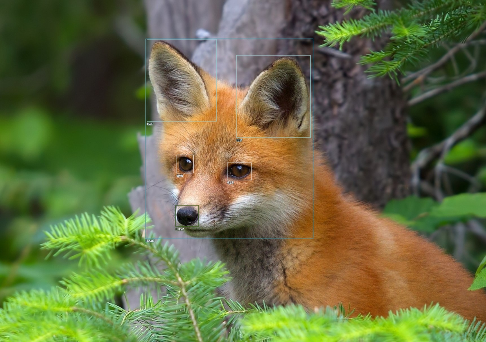
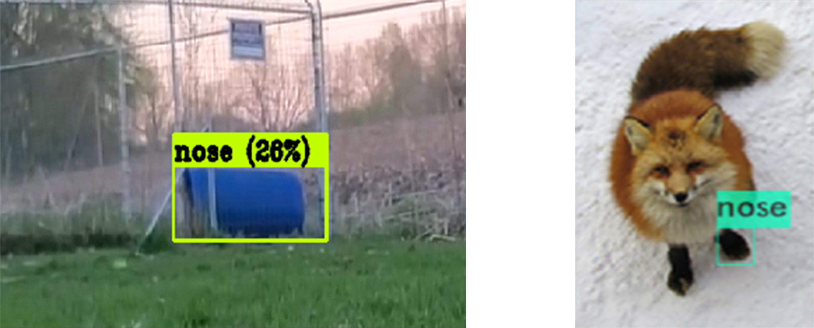
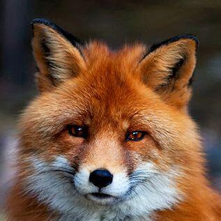

In order to generate high fidelity and detailed images using [DDPM](https://arxiv.org/abs/2006.11239) and [StyleGAN2-ADA](https://arxiv.org/abs/2006.06676), I needed to create a dataset of foxes that were cropped consistently, as the technology, as of writing, is not there yet to produce full images of foxes. Because of the current limitations, I needed to create a dataset of cropped fox heads. The method I decided to utilize was [Yolo object detection.](https://arxiv.org/abs/1506.02640) 

## Collecting Data

Training a [Yolo](https://arxiv.org/abs/1506.02640) object detection model requires a decent sized collection of images containing human-defined bounding boxes with labels. TO create this dataset, I used [Shawn Presser's](https://github.com/shawwn) annotation website [tagpls](https://www.tagpls.com/) and requested a section for a portion of the foxes I've collected. 

Then, a combined effort between some community members and I managed to box and tag several features of 2000+ foxes. 

## Training

After collecting the necessary data, I trained a [YoloV4](https://arxiv.org/pdf/2004.10934.pdf) model on the data locally for several hours until the loss curve flattened. For this type of model, the general rule of thumb is the lower the loss the tighter the predicted bounding box. 

## Evaluation

When the model finally finished training, I tested it on several images. I initially got some questionable results,

but after adjusting some parameters and retraining the model another night, good bounding boxes were created:

## Utilization

After training a functioning model, I ran the model over my entire dataset to create a file containing all of the predicted bounding boxes. Then, utilizing a script I wrote, I parsed the information from the file and cropped out everything except the heads in all of the dataset in the shape of a square. 

