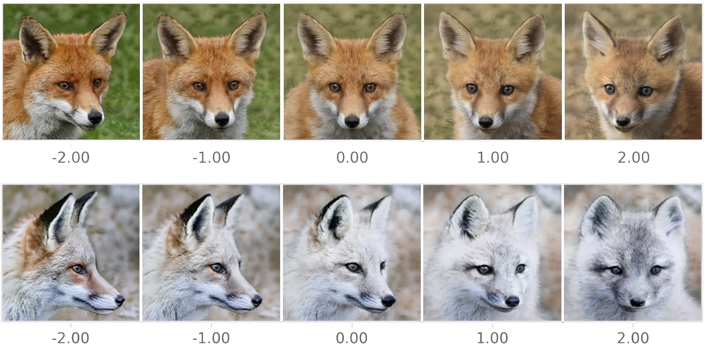
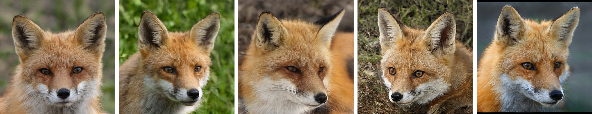

Generating high fidelity images through the power of machine learning has become increasingly trivial and accessible to the average person. NVLab's [StyleGAN2](https://github.com/NVlabs/stylegan2) (SG2) and [StyleGAN2-ADA](https://github.com/NVlabs/stylegan2-ada) (SG2-ADA) generative GAN models can be easily used to generate a wide range of images if provided a large enough well-created dataset. 

## Preparation
Data preparation mainly consisted of gathering data, automatically locating fox heads, and cropping the heads into squares. To locate and crop the heads automatically, I used a YoloV4 model (which I talk about in more detail [here](https://kettukaa.github.io/fox-detection/)) to find the heads, and a script to crop the images. 

## StyleGAN2 vs. StyleGAN2-ADA
One problem with SG2 that SG2-ADA attempts to solve is enabling training on smaller datasets. NVLab's solution to this problem is, what they call, "Adaptive Discriminator Augmentation" or ADA. ADA in addition to the new Augmentation Pipeline allows me to generate higher quality foxes than what was possible in SG2 given the same dataset. The reason I include both SG2 and SG2-ADA is because I had started this project before SG2-ADA existed. So I felt the need to document both models. More information on SG2 vs. SG2-ADA can be found in their respective papers:
 - [https://arxiv.org/abs/1912.04958](https://arxiv.org/abs/1912.04958)
 - [https://arxiv.org/abs/2006.06676](https://arxiv.org/abs/2006.06676)

## Training Methods
For both SG2 and SG2-ADA, I used an existing github repository to train the models.

#### TPU and GPU

The primary difference between how I trained the two models was that SG2 had a repo for utilizing a [Cloud TPU](https://cloud.google.com/tpu) (Tensor Processing Unit), a very powerful computer made specifically with neural networks in mind. Utilizing a TPU allows for fast training and model inference, the only issue is acquiring a TPU. Luckily, [TensorFlow](https://www.tensorflow.org/), the company behind the popular neural network framework of the same name, has a service available called TensorFlow Research Cloud ([TFRC](https://www.tensorflow.org/tfrc)) which allows researchers to apply and use one of Google's TPU V3-8's for no cost, aside from general Google Cloud Platform ([GCP](https://cloud.google.com/)) fees. Luckily, Google offers any new GCP account with $300 in cloud credits, which quickly offset any costs for GCP for a few months.   

SG2's TPU release can be found [here](https://github.com/shawwn/stylegan2/tree/tpu) by Shawn Presser. 

Unfortunately, as of writing, SG2-ADA has not seen a TPU release just yet, so I had to train the SG2-ADA model using a GPU. Luckily, Google's generous hands help me out again by providing a powerful GPU through [Google Colab](https://colab.research.google.com/)

#### Transfer Learning
In both methods, the basic process of training the model is pointing the corresponding training script towards a dataset, and, to reduce the training time, a "pretrained model" where my new model can train from. The process of starting training with an existing similar model is called "Transfer Learning." For the SG2-ADA run, I opted to transfer from Nvidia's [AFHQ Wild pretrained model](https://nvlabs-fi-cdn.nvidia.com/stylegan2-ada/pretrained/).

## Results
The results are astounding. The quality of the images generated is so good, that very often you couldn't tell a fake generated fox from reals. 

Below are nine completely SG2-ADA generated images, these foxes do not exist:

## StyleGAN features
SG comes packaged with a lot of interesting features that deserve a post all on their own (coming soon). In simple terms, SG encodes all possible output images in a representation called "Latent Space." This latent space is simply a 512 dimensional space. When inferencing the model, you seed a random number to a script and the script converts that random number to a random point in this 512 dimensional space. This seemingly simple concept has many very cool use cases:

#### Linear Interpolation — Smoothly Transitioning Between Foxes
The script then passes this point through StyleGAN's generator to produce an image. A neat byproduct of this encoding is that points close a point in latent space are similar to the original point. So, taking two random points in latent space and _linearly interpolating_ between them creates a smooth transition between images:

  

<iframe src="https://www.youtube.com/embed/P-rnhQP-4yE" frameborder="0" allow="accelerometer; clipboard-write; encrypted-media; gyroscope; picture-in-picture" allowfullscreen style='width:100%; height:50vh;'></iframe>

This is possible through Derrick Schultz' [StyleGAN2-ADA repository](https://github.com/dvschultz/stylegan2-ada)

#### Principal Component Analysis — Latent Vector Discovery

Principal Component Analysis, or PCA, is a technique in which data is analyzed and "principal components" of the data are found. These principal components are, in a basic sense, lines that best fit the data. Many best fit lines are computed, and the ones that best fit the data are typically listed first. 

The importance of PCA in GANs is to find "Latent Directions" of the model. These latent directions are important in adjusting the output of the image. While training the model, certain "traits" are nicely encoded into the latent space. PCA can find components that encode for the "most important traits" of the model. For instance, suppose for a moment the fox model had only two dimensions in latent space for simplicity, then lets pretend that I ran PCA over the model and found a latent direction of 

$$
\vec{v} =
\begin{bmatrix}
\frac{\sqrt{2}}{2} \\
\frac{\sqrt{2}}{2}
\end{bmatrix}
$$

After adjusting a random point in latent space by shifting the point in the direction of this vector, I find that this hypothetical latent direction encodes for "head rotation." That means shifting the point in latent space in the direction of this component can be used to rotate the original head. 

The real life example of this can be seen here:

  

<iframe src="https://www.youtube.com/embed/APZnxVJ2wWY"frameborder="0" allow="accelerometer; clipboard-write; encrypted-media; gyroscope; picture-in-picture" allowfullscreen></iframe>
  

Another neat example, The Age Component:

All of this PCA work is possible through [the GANSpace paper](https://arxiv.org/abs/2004.02546) and Erik Härkönen's [GANSpace Notebook](https://colab.research.google.com/github/harskish/ganspace/blob/master/notebooks/Ganspace_colab.ipynb)

#### Truncation PSI
Truncation is a parameter that controls the amount of variation in the output space. A PSI close to 0 will have little to no variation, whereas >1.0 might be too varied to even have a recognizable fox. 

| Truncation PSI | Random Samples                                    |
| -------------- | ------------------------------------------------- |
| $$0.1$$        |  |
| $$0.3$$        |  |
| $$0.5$$        |  |
| $$0.7$$        |  |
| $$1.0$$        |  |
| $$1.5$$        |  |

